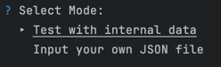

# AWS IAM Role Policy JSON Verifier
Project created as a part of the Remitly Poland interview process.

A tool for verifying AWS IAM Role Policy JSON structures. The project provides a simple, interactive command-line interface for validating JSON files against the AWS IAM Role Policy JSON structure.
Additionally, it introduce an endpoint, which can be used to validate JSON via HTTP POST requests.

**you can skip to the [How to Run](#how-to-run) section to see how to run the project.**

## Intuition
The aim of the project was to create a function that returns False when the resource field is equal to '*' and True otherwise. However, in order for the project to become a fully working solution, 
I developed a validator that checks the format of the entire json file to see if it matches the AWS::IAM::Role Policy documentation.

## Approach
The project is divided into two main parts: the CLI and the API. The CLI is a simple command-line interface that allows the user to validate JSON files. The API is a web server that provides an endpoint for validating JSON via HTTP POST requests.
Both parts use the same internal data to validate JSON files. In order to fully test Json format I created custom validation.

Validation is separated into suites: `empty_fields`, `invalid_format`, `invalid_type`, `resource_content`.
Test data also contains valid JSON Policy files to test the validator.

## All Features
- Validates AWS IAM Role Policy JSON structures
- Provides a CLI for validating JSON files or testing project using internal data
- Provides a web server with an endpoint for validating JSON via HTTP POST requests
- Includes unit tests for all fields in IAM Role Policy JSON structure

## How to Run

To build and run the JSON verifier, follow these steps:

1. Clone the repository:\
`git clone https://github.com/kcbojanowski/remitly-json-verifier`
2. Navigate to cloned directory \
`cd remitly-json-verifier`
3. Build the project\
`go build ./cmd/main.go`
4. Run the project
`./main`

To run web server follow the instructions in the dedicated README file in `api` directory.

## Resources:
The validation is based on **[Documentation provided by AWS](https://docs.aws.amazon.com/IAM/latest/UserGuide/reference_policies_elements.html)**.

## Testing
To run tests, use the following command:
`go test ./...`
or test in in CLI using test data:\

## Self-Assessment
- [x] Method verifying the input JSON data
- [x] Readme includes "how to run" instructions
- [x] Input data format is defined as AWS::IAM::Role Policy
- [x] Unit tests
- [x] Covering edge cases

